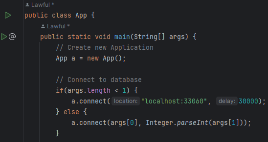
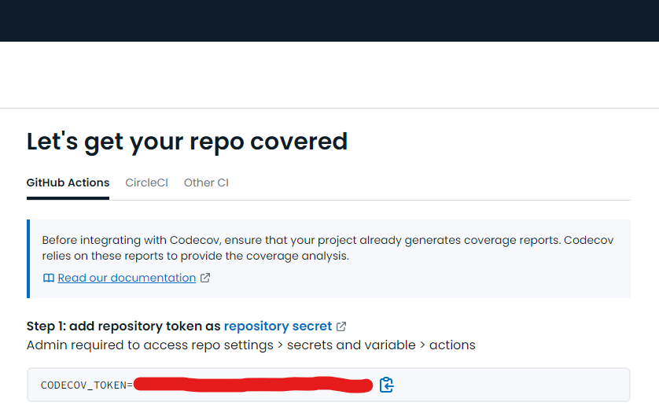
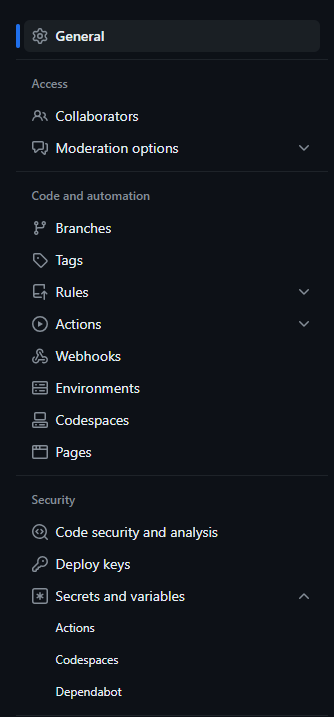
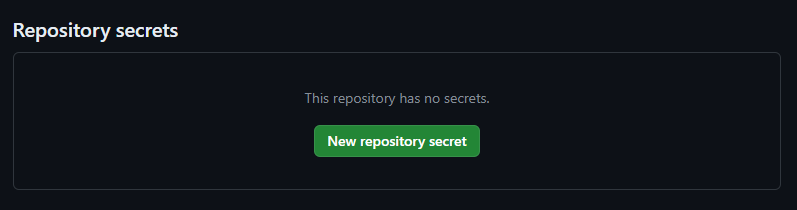
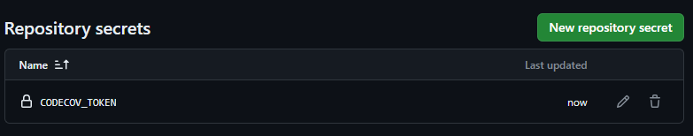

# Lab 07: Integration Testing

In this lab we will build further automated tests for our project, focusing on integration testing. We will modify our App to allow local debugging to save time constantly building docker containers and add Integration testing to out GitHub Actions pipeline.

## Behavioural Objectives

- [ ] **Modify** *our App to allow local connections to the database for faster debugging.*
- [ ] **Create** *integration tests.*
- [ ] **Use code coverage** from *version control.*

## Updating Project

We have some tidying up in our existing project to make our life easier.  We will modify the `pom.xml` file to use a more up-to-date versions of our mysql dependencies that allows local connections. 

### Updating Maven `pom.xml` File

If your mysql driver uses an older version, update the dependencies section of your `pom.xml` to use version 8.0.28 of the mysql driver:

```xml
<dependency>
    <groupId>mysql</groupId>
    <artifactId>mysql-connector-java</artifactId>
    <version>8.0.28</version>
</dependency>
```

### Updating `App.java`

We will also modify our `App.java` file to use the latest mysql connector and to allow the hostname and delay for the database to be set programmatically.  This will allow us to debug our code locally much more quickly than having to build docker containers each time a change is made.

#### Updating `connect`

Below is our updated `connect` method.  The updated lines are:

- The method definition adds `location` and `delay` parameters.
- `Class.forName` which uses the most up-to-date MySQL driver.
- `Driver.getConnection` uses the `location`, and also updates the parameters to use `allowPublicKeyRetrieval=true` as we are using a more up-to-date version of MySQL.

```java
        public void connect(String location, int delay) {
        try {
            // Load Database driver
            Class.forName("com.mysql.cj.jdbc.Driver");
        } catch (ClassNotFoundException e) {
            System.out.println("Could not load SQL driver");
            System.exit(-1);
        }

        int retries = 10;
        boolean shouldWait = false;
        for (int i = 0; i < retries; ++i) {
            System.out.println("Connecting to database...");
            try {
                if (shouldWait) {
                    // Wait a bit for db to start
                    Thread.sleep(delay);
                }
                
                // Connect to database              
                con = DriverManager.getConnection("jdbc:mysql://" + location 
                        + "/employees?allowPublicKeyRetrieval=true&useSSL=false", 
                              "root", "example");
                System.out.println("Successfully connected");
                break;
            } catch (SQLException sqle) {
                System.out.println("Failed to connect to database attempt " + i);
                System.out.println(sqle.getMessage());

                // Let's wait before attempting to reconnect
                shouldWait = true;
            } catch (InterruptedException ie) {
                System.out.println("Thread interrupted? Should not happen.");
            }
        }
    }
```


#### Updating `main`

Modify the main method to use command line parameters, if supplied, or to default to localhost.

```java
      public static void main(String[] args) {
        // Create new Application and connect to database
        App a = new App();

        if (args.length < 1) {
            a.connect("localhost:33060", 10000);
        } else {
            a.connect(args[0], Integer.parseInt(args[1]));
        }

        Department dept = a.getDepartment("Development");
        ArrayList<Employee> employees = a.getSalariesByDepartment(dept);


        // Print salary report
        a.printSalaries(employees);

        // Disconnect from database
        a.disconnect();
    }
```
#### Updating `pom.xml` to Set JAR Filename

At the start of the project we built a JAR file with the version number and `jar-with-dependencies` added to the name.  This has slowly become problematic with the number of files where our version number is provided.  Therefore, we will update the `pom.xml` file to produce a JAR file called `seMethods`.

The section we have to update is in the `<build><plugins>` section for the `maven-assembly-plugin`.  The updated version is below:

```xml
<plugin>
    <groupId>org.apache.maven.plugins</groupId>
    <artifactId>maven-assembly-plugin</artifactId>
    <version>3.3.0</version>
    <configuration>
        <finalName>seMethods</finalName>
        <archive>
            <manifest>
                <mainClass>com.napier.sem.App</mainClass>
            </manifest>
        </archive>
        <descriptorRefs>
            <descriptorRef>jar-with-dependencies</descriptorRef>
        </descriptorRefs>
        <appendAssemblyId>false</appendAssemblyId>
    </configuration>
    <executions>
        <execution>
            <id>make-assembly</id>
            <phase>package</phase>
            <goals>
                <goal>single</goal>
            </goals>
        </execution>
    </executions>
</plugin>
```

We have set `<finalName>` and stated we do not want the ID attached (`<appendAssemblyId>` is set to `false`).  Our Maven build will now produce a file called `seMethods.jar`.

#### Updating `Dockerfile` for Application

Now we need to update the `Dockerfile` for the application to use the new JAR file name, and to provide the correct location for the database.  The updated `Dockerfile` is below.

```dockerfile
FROM openjdk:latest
COPY ./target/seMethods.jar /tmp
WORKDIR /tmp
ENTRYPOINT ["java", "-jar", "seMethods.jar", "db:3306", "10000"]
```

## Enabling Local Debugging

Make sure you have exposed the docker database port 

Your `docker-compose.yml` file should be:

```yml
version: '3'
services:
  # Application Dockerfile is in same folder which is .
  app:
    build: .

  # db is is db folder
  db:
    build: db/.
    command: --default-authentication-plugin=mysql_native_password
    restart: always
    ports:
      - "33060:3306"

```

The last line tells docker to make port 3306 available on our local machine on port 33060

Delete your old containers and images and restart the database from the docker compose file using the arrow at line 8 below.


You can leave the database running to save having to rebuild each time you want to connect. 

When the database is running and ready for connections the log from the docker container should show `ready for connections`:


You should now be able to run the App locally without having to package and build docker images

Just start the App directly  using the arrow next to the main method.



The new version of App should work locally either running directly or by starting from docker compose and on GitHub Actions without any modification.

Test that all three scenarios are working

- Locally as described above by running the App directly
- Locally in docker using docker compose to start the App (remember to delete target directory, old containers and images, repackage with maven, recreate and start App image using docker compose )
- Remotely on GitHub Actions

We want to separate our tests into different files as we will have different types of tests.  Unit tests and integration tests are different, and we want to manage them as such.

### Adding GitHub Actions Job Stages

From the [Continuous Integration lecture](../../units/unit08/unit08a.md) we defined the following steps in a basic build script:

1. Clean.
2. Compile source code.
3. Integrate database.
4. Run tests.
5. Run inspections.
6. Deploy software.

We will update our GitHub Actions workflow to separate the different stages

```yml
name: A workflow for my Hello World App
on: push

jobs:
  UnitTests:
    name: Unit Tests
    runs-on: ubuntu-20.04
    steps:
      - name: Checkout
        uses: actions/checkout@v2
        with:
          submodules: recursive
      - name: Set up JDK 11
        uses: actions/setup-java@v2
        with:
          java-version: '11'
          distribution: 'adopt'
      - name: Unit Tests
        run: mvn -Dtest=com.napier.sem.AppTest test

  build:
    name: Build and Start Using docker compose
    runs-on: ubuntu-20.04
    steps:
      - name: Checkout
        uses: actions/checkout@v2
        with:
          submodules: recursive
      - name: Set up JDK 11
        uses: actions/setup-java@v2
        with:
          java-version: '11'
          distribution: 'adopt'
      - name: Package and Run docker compose
        run: |
          mvn package -DskipTests
          docker compose up --abort-on-container-exit

```

We have separated our tasks into different jobs. This allows us to define build stages for more control. It also allows the different jobs to run concurrently on GitHub Actions speeding up the process. **Commit** and **push** this change.  If successful then you should see the different stages on GitHub Actions as shown below.


## Adding Integration Tests

Remember that Unit Tests are check the integrity of the smallest parts of our program. These do not need a connection to the database.  We are now ready to write integration tests.  These are tests against our database, and therefore we need to be connected.  Our tests will be written in the same manner as unit tests, but require a bit more configuration.

### Adding Integration Test File

Add a new Java file to the test folder called `AppIntegrationTest.java`.  The code for the file is below.

```java
package com.napier.sem;

import org.junit.jupiter.api.BeforeAll;
import org.junit.jupiter.api.Test;
import org.junit.jupiter.api.TestInstance;

import java.util.ArrayList;

import static org.junit.jupiter.api.Assertions.*;

public class AppIntegrationTest
{
    static App app;

    @BeforeAll
    static void init()
    {
        app = new App();
        app.connect("localhost:33060", 30000);
        
    }

    @Test
    void testGetEmployee()
    {
        Employee emp = app.getEmployee(255530);
        assertEquals(emp.emp_no, 255530);
        assertEquals(emp.first_name, "Ronghao");
        assertEquals(emp.last_name, "Garigliano");
    }
}
```

We are testing the `getEmployee` method to see if it returns a correct answer.  A random entry to the database has been used.  With this in place, we can update our GitHub Actions workflow.

### Update GitHub Actions

All we need to do now is update the GitHub Actions `main.yml` file to run our integration tests:

```yml
name: A workflow for my Hello World App
on:
  push:
    branches:
      - master
      - develop
jobs:
  UnitTests:
    name: Unit Tests
    runs-on: ubuntu-20.04
    steps:
      - name: Checkout
        uses: actions/checkout@v2
        with:
          submodules: recursive
      - name: Set up JDK 11
        uses: actions/setup-java@v2
        with:
          java-version: '11'
          distribution: 'adopt'
      - name: Unit Tests
        run: mvn -Dtest=com.napier.sem.AppTest test

  IntegrationTests:
    name: Integration Tests
    runs-on: ubuntu-20.04
    steps:
      - name: Checkout
        uses: actions/checkout@v2
        with:
          submodules: recursive
      - name: Set up JDK 11
        uses: actions/setup-java@v2
        with:
          java-version: '11'
          distribution: 'adopt'
      - name: Integration Tests
        run: |
          docker build -t database ./db 
          docker run --name employees -dp 33060:3306 database
          mvn -Dtest=com.napier.sem.AppIntegrationTest test
          docker stop employees
          docker rm employees
          docker image rm database                    

  build:
    name: Build and Start Using docker compose
    runs-on: ubuntu-20.04
    steps:
      - name: Checkout
        uses: actions/checkout@v2
        with:
          submodules: recursive
      - name: Set up JDK 11
        uses: actions/setup-java@v2
        with:
          java-version: '11'
          distribution: 'adopt'
      - name: Package and Run docker compose
        run: |
          mvn package -DskipTests
          docker compose up --abort-on-container-exit

```

We have added an `integration tests` stage to invoke `mvn test` on the `AppIntegrationTest` file.  **Commit and push** your changes and check that everything still works on GitHub Actions

## Exercise: Add Integration Tests

Now your task is to write integration tests to ensure that your application works correctly in all cases.  You have the template in `AppIntegrationTest.java`.  Add similar tests that test all the pathways and conditions through your code.

## Adding Code Coverage

Last week we looked at using IntelliJ to provide a code coverage report.  This is good for working at a single workstation, but our aim is to make information global.  Therefore, we will use an online code coverage tool to generate reports.

### Creating an Account with Codecov

We are going to use a service called [Codecov](https://codecov.io/).  First, you need to go to their website and signup via your GitHub account.  The process from then should be fairly straightforward, but if you have any problems ask.

### Updating `pom.xml` to Provide Code Coverage

We need Maven to generate reports for us.  There are different plugins that can do this for us, and we will use the jacoco one.  Add the following to the `plugins` section of the `pom.xml` file:

```xml
<plugin>
    <groupId>org.jacoco</groupId>
    <artifactId>jacoco-maven-plugin</artifactId>
    <version>0.8.12</version>
    <executions>
        <execution>
            <goals>
                <goal>prepare-agent</goal>
            </goals>
        </execution>
        <execution>
            <id>report</id>
            <phase>test</phase>
            <goals>
                <goal>report</goal>
            </goals>
        </execution>
    </executions>
</plugin>
```

That is all we have to do in our Maven file.  Everything else is automated.

### Updating `.main.yml` to Upload Code Coverage

We will add another action to the Integration Test stage of our GitHub Actions `main.yml` file to upload the coverage reports created during the maven test stage to codecov. 

```yml
name: A workflow for my Hello World App
on:
  push:
    branches:
      - master
      - develop
jobs:
  UnitTests:
    name: Unit Tests
    runs-on: ubuntu-20.04
    steps:
      - name: Checkout
        uses: actions/checkout@v2
        with:
          submodules: recursive
      - name: Set up JDK 11
        uses: actions/setup-java@v2
        with:
          java-version: '11'
          distribution: 'adopt'
      - name: Unit Tests
        run: mvn -Dtest=com.napier.sem.AppTest test

  IntegrationTests:
    name: Integration Tests
    runs-on: ubuntu-20.04
    steps:
      - name: Checkout
        uses: actions/checkout@v2
        with:
          submodules: recursive
      - name: Set up JDK 11
        uses: actions/setup-java@v2
        with:
          java-version: '11'
          distribution: 'adopt'
      - name: Integration Tests and CodeCov
        run: |
          docker build -t database ./db 
          docker run --name employees -dp 33060:3306 database
          mvn -Dtest=com.napier.sem.AppIntegrationTest test          
          docker stop employees
          docker rm employees
          docker image rm database                    
      - name: CodeCov
        uses: codecov/codecov-action@v4.0.1
        with:
          token: ${{ secrets.CODECOV_TOKEN }} # now required for public repos too
          directory: ./target/site/jacoco
          flags: Integration Tests # optional
          verbose: true # optional (default = false)
          slug: <GitHub username>/<repository name>
  build:
    name: Build and Start Using docker compose
    runs-on: ubuntu-20.04
    steps:
      - name: Checkout
        uses: actions/checkout@v2
        with:
          submodules: recursive
      - name: Set up JDK 11
        uses: actions/setup-java@v2
        with:
          java-version: '11'
          distribution: 'adopt'
      - name: Package and Run docker compose
        run: |
          mvn package -DskipTests
          docker compose up --abort-on-container-exit

```

Please note that the following part of this code has to be updated with your own details:

```yml
slug: <github-username>/<repo-name>
```

For example:

```yml
slug: kevin-sim/sem_employees
```

The jacoco maven plugin creates html reports in the `./target/site/jacoco` folder. The new action shown below uploads this folder to `https://codecov.io`

```yml
- name: CodeCov
  uses: codecov/codecov-action@v4.0.1
  with:
    token: ${{ secrets.CODECOV_TOKEN }}
    directory: ./target/site/jacoco
    flags: Integration Tests # optional
    verbose: true # optional (default = false)
    slug: Lawful24/sem-demo-labs
```

### Adding Your First GitHub Secret

Just like GitHub, CodeCov also uses personal access tokens, but for each repository instead of each user. Before we can get the code coverage report of our repository, we need to add this token to our repository on GitHub.

GitHub Secrets is a handy tool if you want certain parts of your project to be accessible by the users or services of your choosing. It allows you to assign hidden values to your repository that only the admins of the repository can access and don't get downloaded when someone clones your repository.

For this project, we will only need to add one secret to our repository to verify ourselves when CodeCov tries to access our project during the GitHub action job defined above.

First, go to `https://codecov.io/gh/<github-username>/<repo-name>`. This is the CodeCov page of your repository. Make sure to replace the placeholder text with your details, for example, `https://codecov.io/gh/kevin-sim/sem_employees`.

You will come across the default page since we have yet to share our code coverage report with CodeCov.



Copy the whole line starting with `CODECOV_TOKEN=...` and go to the Settings page of your GitHub repository.

Find "**Secrets and variables**" and go to "**Actions**".



Here, we have two options to register a new secret. We need a new "**Repository Secret**".



Enter "`CODECOV_TOKEN`" to the top bar and copy the value of the token into the text area below. Then click on "**Add secret**".


Now you should have an entry on the previous page in "**Repository Secrets**".



Now **commit and push** the changes you have made to your `main.yml` file.  GitHub Actions should undertake the build process, and once one stage is complete you can view it at `https://codecov.io/gh/<github-username>/<repo-name>`.  For example, `https://codecov.io/gh/kevin-sim/sem_employees`.


### Adding Your Code Coverage Badge

Under the *Settings* area of Codecov you will find the necessary markdown for your code coverage badge:


**Add the Markdown to your project `readme.md` for both the `master` and `develop` branches.**  This will allow you to see your code coverage status from your main GitHub project page.

## Next Feature: Add New Employee

We will now add a new feature to our application: adding a new employee.  We will adopt a Test-Driven Development approach by first writing the test.  First, add the empty method to `App.java`:

```java
public void addEmployee(Employee emp)
{

}
```

And add the following code to your `AppIntergrationTest.java` file:

```java
@Test
void testAddEmployee()
{
    Employee emp = new Employee();
    emp.emp_no = 500000;
    emp.first_name = "Kevin";
    emp.last_name = "Chalmers";
    app.addEmployee(emp);
    emp = app.getEmployee(500000);
    assertEquals(emp.emp_no, 500000);
    assertEquals(emp.first_name, "Kevin");
    assertEquals(emp.last_name, "Chalmers");
}
```

Running this test (you should be able to do so straight from IntelliJ if your database is still running in the background) will fail.  This is because we haven't written the code yet.  Let us do that now.  Update `addEmployee` to the following:

```java
public void addEmployee(Employee emp)
{
    try
    {
        Statement stmt = con.createStatement();
        String strUpdate =
                "INSERT INTO employees (emp_no, first_name, last_name, birth_date, gender, hire_date) " +
                "VALUES (" + emp.emp_no + ", '" + emp.first_name + "', '" + emp.last_name + "', " +
                "'9999-01-01', 'M', '9999-01-01')";
        stmt.execute(strUpdate);
    }
    catch (Exception e)
    {
        System.out.println(e.getMessage());
        System.out.println("Failed to add employee");
    }
}
```

And the test should pass.  **Commit and push** and check with GitHub Actions.

## Cleanup

As always, cleanup your system.  Stop any running containers, commit everything, and bring your branches up-to-date.
